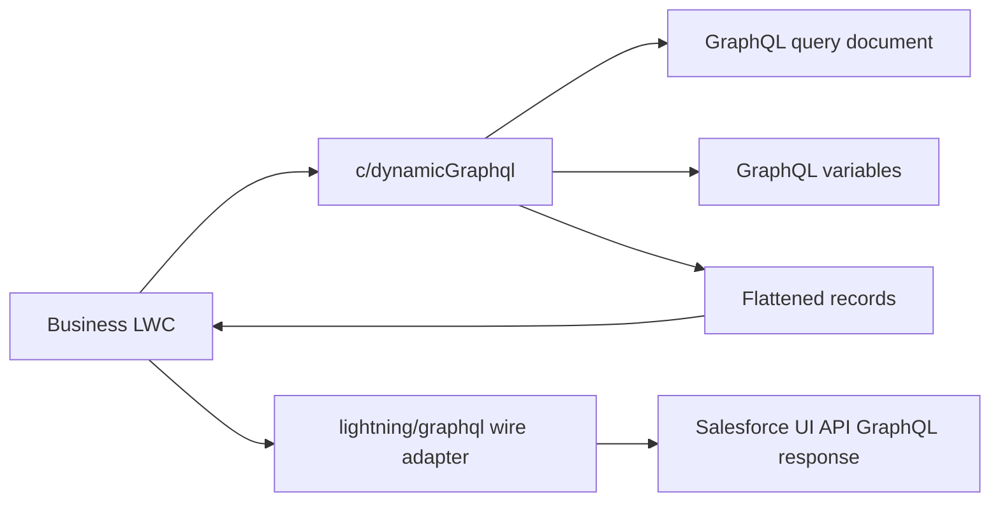

# LWC Reusable Dynamic GraphQL Query

This repository contains a reusable JavaScript API module for building dynamic Salesforce GraphQL queries in Lightning Web Components.

The main goal of this phase is not to build only one datatable. The goal is to create a reusable GraphQL query layer that can be imported by many LWCs: datatables, cards, charts, dashboards, forms, or any future business component that needs dynamic Salesforce data.

## What this project provides

- A template-free LWC JavaScript module: `c/dynamicGraphql`
- Runtime GraphQL query generation using `lightning/graphql`
- Dynamic object support
- Dynamic direct field support
- Dynamic nested parent relationship field support
- Dynamic `where` filter support
- Parent field filter support
- Dynamic `orderBy` support
- Record limit support
- Response flattening helper for UI API GraphQL results
- A simple card-based demo component that consumes the reusable query module
- Detailed documentation with practical examples

## Current phase scope

This phase focuses on the reusable GraphQL query functionality.

Included:

- `force-app/main/default/lwc/dynamicGraphql`
- `force-app/main/default/lwc/graphqlProviderCardsDemo`
- `docs/reusable-dynamic-graphql.md`

Not the focus of this phase:

- Rebuilding the reusable datatable
- Building a separate configuration manager screen
- Manual copy/paste JSON configuration workflow

The reusable datatable can later consume this same `c/dynamicGraphql` module without duplicating query-building logic.

## Repository structure

```text
force-app/
  main/
    default/
      lwc/
        dynamicGraphql/
          dynamicGraphql.js
          dynamicGraphql.js-meta.xml
          __tests__/
            dynamicGraphql.test.js

        graphqlProviderCardsDemo/
          graphqlProviderCardsDemo.html
          graphqlProviderCardsDemo.js
          graphqlProviderCardsDemo.css
          graphqlProviderCardsDemo.js-meta.xml
          __tests__/
            graphqlProviderCardsDemo.test.js

docs/
  reusable-dynamic-graphql.md
```

## Main reusable module

The reusable module is:

```js
import {
  createDynamicGraphqlQuery,
  createDynamicGraphqlVariables,
  flattenDynamicGraphqlRecords,
  extractDynamicGraphqlNodes
} from "c/dynamicGraphql";
```

The module does not have an HTML template. It is a JavaScript-only LWC module used by other components.

## Why this is reusable

`lightning/graphql` must be wired inside an LWC component, but query construction does not need to be duplicated in every component.

This project separates the responsibilities:



The consuming component owns the UI and the `@wire(graphql)` call. The shared module owns the configuration parsing, query generation, variables, and response flattening.

## API version

The reusable module is configured with API version `67.0`:

```xml
<apiVersion>67.0</apiVersion>
```

This keeps the component aligned with current LWC GraphQL capabilities and Summer '26 behavior.

## Quick start

Create a configuration object:

```js
const configuration = {
  objectApiName: "Account",
  fields: ["Name", "Industry", "AnnualRevenue"],
  where: {
    Industry: { eq: "Technology" }
  },
  orderBy: {
    Name: { order: "ASC" }
  },
  recordLimit: 10
};
```

Use the reusable module in your LWC:

```js
import { LightningElement, wire } from "lwc";
import { graphql } from "lightning/graphql";
import {
  createDynamicGraphqlQuery,
  createDynamicGraphqlVariables,
  flattenDynamicGraphqlRecords
} from "c/dynamicGraphql";

export default class MyGraphqlConsumer extends LightningElement {
  configuration = {
    objectApiName: "Account",
    fields: ["Name", "Industry", "AnnualRevenue"],
    where: { Industry: { eq: "Technology" } },
    orderBy: { Name: { order: "ASC" } },
    recordLimit: 10
  };

  query = createDynamicGraphqlQuery(this.configuration);
  variables = createDynamicGraphqlVariables(this.configuration);
  records = [];
  errors = [];

  @wire(graphql, { query: "$query", variables: "$variables" })
  wiredGraphql(result) {
    this.errors = result.errors || [];

    if (result.data) {
      this.records = flattenDynamicGraphqlRecords({
        data: result.data,
        objectApiName: this.configuration.objectApiName,
        fieldConfigs: this.configuration.fields
      });
    }
  }
}
```

## Configuration format

The module accepts either a JavaScript object or a JSON string.

```json
{
  "title": "Technology Accounts",
  "objectApiName": "Account",
  "fields": ["Name", "Phone", "Industry", "AnnualRevenue"],
  "where": {
    "and": [
      { "Industry": { "eq": "Technology" } },
      { "AnnualRevenue": { "gte": 1000000 } }
    ]
  },
  "recordLimit": 25,
  "orderBy": {
    "CreatedDate": { "order": "DESC" }
  }
}
```

Supported top-level properties:

| Property        | Required | Description                                                                |
| --------------- | -------- | -------------------------------------------------------------------------- |
| `objectApiName` | Yes      | Salesforce object API name, such as `Account` or `Contact`.                |
| `objectName`    | No       | Backward-compatible alias for `objectApiName`.                             |
| `fields`        | Yes      | Fields to query. Supports direct fields and nested parent paths.           |
| `fieldApiNames` | No       | Backward-compatible alias for `fields`.                                    |
| `where`         | No       | GraphQL UI API filter object.                                              |
| `whereClause`   | No       | Backward-compatible alias for `where`.                                     |
| `orderBy`       | No       | GraphQL UI API order object or simple string such as `CreatedDate DESC`.   |
| `recordLimit`   | No       | Number of records to return. Defaults to `10`. Maximum is capped at `200`. |
| `limit`         | No       | Backward-compatible alias for `recordLimit`.                               |
| `title`         | No       | Optional display title for consuming components.                           |

## Query direct fields

Example:

```js
const configuration = {
  objectApiName: "Account",
  fields: ["Name", "Phone", "Industry"],
  recordLimit: 10
};
```

The module generates the UI API field shape automatically:

```graphql
Name {
  value
  displayValue
}
Phone {
  value
  displayValue
}
Industry {
  value
  displayValue
}
```

`Id` is treated as a scalar field and is automatically added when missing.

## Query parent relationship fields

Use dot notation for parent relationship paths.

Example: query Contacts with Account details.

```js
const configuration = {
  objectApiName: "Contact",
  fields: [
    "Name",
    "Email",
    {
      apiName: "Account.Name",
      label: "Account Name",
      dataKey: "accountName"
    },
    {
      apiName: "Account.Industry",
      label: "Account Industry",
      dataKey: "accountIndustry"
    }
  ],
  recordLimit: 10
};
```

The module builds the nested GraphQL selection:

```graphql
Account {
  Name {
    value
    displayValue
  }
  Industry {
    value
    displayValue
  }
}
```

Flattened output example:

```json
{
  "Id": "003...",
  "Name": "John Smith",
  "Email": "john@example.com",
  "accountName": "Acme",
  "accountIndustry": "Technology"
}
```

## Query nested parent relationship fields

Nested parent paths are also supported.

Example: Contact → Account → Parent Account.

```js
const configuration = {
  objectApiName: "Contact",
  fields: [
    "Name",
    "Email",
    {
      apiName: "Account.Parent.Name",
      label: "Parent Account",
      dataKey: "parentAccountName"
    }
  ],
  recordLimit: 10
};
```

The module supports parent paths up to the configured safety depth.

## WHERE condition examples

Simple equality:

```js
const configuration = {
  objectApiName: "Account",
  fields: ["Name", "Industry"],
  where: {
    Industry: { eq: "Technology" }
  }
};
```

AND condition:

```js
const configuration = {
  objectApiName: "Account",
  fields: ["Name", "Industry", "AnnualRevenue"],
  where: {
    and: [
      { Industry: { eq: "Technology" } },
      { AnnualRevenue: { gte: 1000000 } }
    ]
  }
};
```

OR condition:

```js
const configuration = {
  objectApiName: "Account",
  fields: ["Name", "Industry"],
  where: {
    or: [{ Industry: { eq: "Technology" } }, { Industry: { eq: "Healthcare" } }]
  }
};
```

IN condition:

```js
const configuration = {
  objectApiName: "Account",
  fields: ["Name", "Industry"],
  where: {
    Industry: {
      in: ["Technology", "Healthcare", "Finance"]
    }
  }
};
```

## Parent field filter examples

Filter Contacts by parent Account industry:

```js
const configuration = {
  objectApiName: "Contact",
  fields: [
    "Name",
    "Email",
    {
      apiName: "Account.Name",
      dataKey: "accountName"
    },
    {
      apiName: "Account.Industry",
      dataKey: "accountIndustry"
    }
  ],
  where: {
    Account: {
      Industry: { eq: "Technology" }
    }
  },
  recordLimit: 20
};
```

Filter Contacts by nested parent Account:

```js
const configuration = {
  objectApiName: "Contact",
  fields: [
    "Name",
    {
      apiName: "Account.Parent.Name",
      dataKey: "parentAccountName"
    }
  ],
  where: {
    Account: {
      Parent: {
        Industry: { eq: "Technology" }
      }
    }
  },
  recordLimit: 20
};
```

## Ordering examples

GraphQL object syntax:

```js
const configuration = {
  objectApiName: "Account",
  fields: ["Name", "CreatedDate"],
  orderBy: {
    CreatedDate: { order: "DESC" }
  }
};
```

Simple string syntax:

```js
const configuration = {
  objectApiName: "Account",
  fields: ["Name", "CreatedDate"],
  orderBy: "CreatedDate DESC"
};
```

The simple string format is converted internally to the GraphQL object format.

## Public functions

### `normalizeDynamicGraphqlConfiguration(input)`

Parses and normalizes the input configuration.

Use this when you want to validate configuration before building the query.

### `createDynamicGraphqlQuery(input)`

Builds the `gql` query document.

Use this value as the `query` parameter for the `lightning/graphql` wire adapter.

### `createDynamicGraphqlVariables(input)`

Builds the GraphQL variables object.

Currently this includes:

- `first`
- `where`
- `orderBy`, when configured

### `flattenDynamicGraphqlRecords({ data, objectApiName, fieldConfigs })`

Converts Salesforce UI API GraphQL response nodes into plain JavaScript records.

This is useful for:

- `lightning-datatable`
- cards
- charts
- computed business UI
- parent relationship display fields

### `extractDynamicGraphqlNodes(data, objectApiName)`

Returns the raw GraphQL node objects from the UI API connection response.

Use this when you do not want flattened records.

## Demo component

The sample consumer is:

```text
force-app/main/default/lwc/graphqlProviderCardsDemo
```

It demonstrates how to:

- Import `c/dynamicGraphql`
- Build a dynamic query
- Build variables
- Wire the query using `lightning/graphql`
- Flatten records
- Render the results in a non-datatable UI

## Local setup

Install dependencies:

```bash
npm install
```

Run unit tests:

```bash
npm run test:unit
```

Run formatting verification:

```bash
npm run prettier:verify
```

Run lint:

```bash
npm run lint
```

## Deploy to Salesforce

Deploy the reusable module and demo component:

```bash
sf project deploy start \
  --source-dir force-app/main/default/lwc/dynamicGraphql \
  --source-dir force-app/main/default/lwc/graphqlProviderCardsDemo \
  --target-org agentforcedev
```

If you use a different org alias, replace `agentforcedev` with your org alias.

## Important limitations

- GraphQL object names and field selections cannot be passed as GraphQL variables. They must be part of the generated query document.
- User values should go through GraphQL variables where possible.
- Do not build object names or field names directly from raw user input.
- Use an allowlist for production configuration.
- Dynamic query construction does not provide the same referential integrity protection as static object and field references.
- Field-level security and sharing behavior still depend on Salesforce UI API and the running user context.
- The module generates parent field selections, but the relationship names must match Salesforce GraphQL relationship names.

## Recommended production approach

For production use, keep configuration controlled.

Recommended pattern:

```js
const ALLOWED_OBJECTS = {
  Account: ["Id", "Name", "Phone", "Industry", "AnnualRevenue"],
  Contact: ["Id", "Name", "Email", "Phone", "Account.Name", "Account.Industry"]
};
```

Only build queries from approved object and field names.

## Detailed documentation

Read the full usage guide here:

[docs/reusable-dynamic-graphql.md](docs/reusable-dynamic-graphql.md)

That guide includes:

- Complete architecture explanation
- Configuration reference
- Parent field examples
- Nested parent relationship examples
- Direct WHERE condition examples
- Parent filter examples
- Ordering examples
- Complete LWC consumer example
- Response shape examples
- Maintenance guidance

## Salesforce references

- [GraphQL wire adapter for LWC](https://developer.salesforce.com/docs/platform/lwc/guide/reference-graphql-wire.html)
- [GraphQL relationship queries](https://developer.salesforce.com/docs/platform/lwc/guide/reference-graphql-relationships.html)
- [GraphQL filter results](https://developer.salesforce.com/docs/platform/graphql/guide/filter.html)
- [GraphQL parent relationship filters](https://developer.salesforce.com/docs/platform/graphql/guide/filter-parent.html)
- [GraphQL order results](https://developer.salesforce.com/docs/platform/graphql/guide/order.html)

## Maintenance rule

When the reusable query module changes, update both:

- `README.md`
- `docs/reusable-dynamic-graphql.md`

This keeps the repository landing page and the detailed developer guide aligned.
